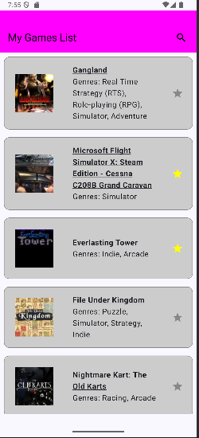
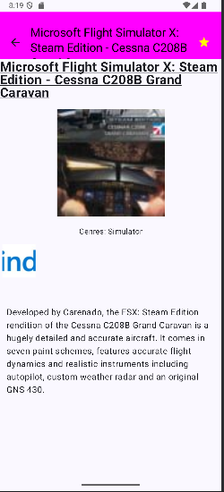

# My Games App 

## Overview 
My Games List is an Android application built using Kotlin and Jetpack Compose. It allows users to browse and manage a list of their favorite video games. The app fetches data dynamically using the IGDB API ([IGDB API Documentation](https://api-docs.igdb.com/#getting-started)) and provides a seamless user experience with features like search, favorites, and detailed game information.

## Table of Contents
- [Overview](#overview)
- [Image of Application](#image-of-application)
- [Technologies Used](#technologies-used)
- [Data Source](#data-source)
- [Installation](#installation)
- [Getting Your API Credentials](#getting-your-api-credentials)
    - [Using Postman to Get Access Token](#using-postman-to-get-access-token)
    - [Using Terminal to Get Access Token](#using-terminal-to-get-access-token)
- [Usage](#usage)
    - [Game List Screen](#game-list-screen)
    - [Game Detail Screen](#game-detail-screen)
- [Features](#features)
    - [My Games List Screen](#my-games-list-screen)
    - [Game Details Screen](#game-details-screen)
    - [Navigation Between Screens](#navigation-between-screens)
    - [Search Functionality](#search-functionality)
    - [Favorites System](#favorites-system)
    - [Error Handling](#error-handling)
- [Code Structure](#code-structure)
- [Future Improvements](#future-improvements)

## Image of Application
|             MyGamesListScreen             |                      GameDetailScreen                       |
|:-----------------------------------------:|:---------------------------------------------:| 
|  |  |


## Technologies Used

- **Kotlin**: Primary programming language
- **Jetpack Compose**: Modern UI toolkit for Android
- **Retrofit**: HTTP client for API communication
- **Kotlinx Serialization**: JSON parsing
- **Coil**: Image loading library
- **IGDB API**: Video game database API
- **Coroutines**: Asynchronous programming

## Data Source
Initially, the data was stored in local JSON files:

- games.json
- genres.json
- platforms.json
- covers.json
- platform_logos.json

Later, the app was updated to fetch data dynamically using the IGDB API ([API Documentation](https://api-docs.igdb.com/#getting-started)). This allows the app to always display up-to-date information and reduces the need for manual data updates.

## Installation
1. Clone the repository: 
``` bash
git clone git@github.com:maiyenkhuong/INSA_MyGamesList_20242025.git 
```
2. Open the project in Android Studio
3. Configure your IGDB API credentials in IGDBApi.kt:
``` kotlin
@Headers(
    "Client-ID: your-client-id",
    "Authorization: Bearer your-access-token",
    "Accept: application/json"
)
```
## Getting Your API Credentials
1. Create an account on Twitch Developer Portal
2. Register a new application to get your Client ID
3. Generate an access token using Postman or terminal
### Using Postman to Get Access Token
1. Access to PostMan via this link : 
[PostMan](https://www.postman.com/)
2. Create a new POST request to https://id.twitch.tv/oauth2/token
3. Add the following query parameters:
* client_id: Your client ID
* client_secret: Your client secret
* grant_type: client_credentials
4. Send the request and copy the access token from the response

### Using Terminal to Get Access Token
``` bash
curl -X POST "https://id.twitch.tv/oauth2/token" \
-d "client_id=YOUR_CLIENT_ID&client_secret=YOUR_CLIENT_SECRET&grant_type=client_credentials"
```
**Remark** : Replace the placeholder credentials in IGDBApi.kt with your actual Client ID and access token.

## Usage
### Game List Screen
- Displays a list of games in a vertically scrollable LazyColumn.
- Use the search bar at the top to filter games by name, genre, or platform.
- Tap on a game to navigate to the Game Detail Screen.

### Game Detail Screen
- Displays detailed information about the selected game.
- The platform logos are shown in a horizontal scrollable LazyRow.
- Tap the star icon to add or remove the game from your favorites list.


## Features
1. My Games List Screen
* The game list is displayed in a vertically scrollable layout using LazyColumn in Jetpack Compose.
* Each game item includes:
    * Game name
    * Cover image.  If the cover image is slow to load due to the asynchronous functionality, it will appear after a short delay.
    * Genres
* If a game does not have a cover image, a default "No image available" placeholder is displayed using the following link:
  https://upload.wikimedia.org/wikipedia/commons/1/14/No_Image_Available.jpg
2. Game Details Screen
* Tap on a game in My Games List to view its detailed information, including:
    * Cover image
    * Genres
    * Platforms with their logos displayed in a horizontal scrollable list
    * Summary of the game
* The platform logos are fetched asynchronously and displayed in a horizontal slider, allowing users to scroll through them if there are multiple platforms
3. Navigation Between Screens
* The app uses Jetpack Navigation Compose to manage navigation between two main screens:
    * Game List Screen: Displays the list of games.
    * Game Detail Screen: Displays detailed information about a selected game.
* Users can navigate back to the game list screen using the back button in the top app bar.
* If users navigate back while they are in GamesListScreen, they will quit the application.
4. Search Functionality
* Users can search for games by: name, genre, platform.
* The search bar is displayed at the top of the game list screen.
* The search results are updated dynamically as the user types.

5. Favorites System
* Users can add or remove games from their favorites list by tapping the star icon on either the Game List Screen or the Game Detail Screen.
* The favorite status is synchronized between both screens.

6. Error Handling
* The app gracefully handles errors and missing data:
    * If a game does not have a cover image, a default placeholder is displayed.
    * If a platform logo does not have a URL, it is replaced with the "No image available" placeholder.
    * If the API fails to fetch data, the app does not crash and continues to function with the available data.


## Code Structure
The project is organized as follows:
- MainActivity.kt: Main activity containing UI components and navigation
- IGDBApi.kt: Retrofit interface for API communication
- IGDBInstance.kt: Retrofit instance configuration
- IGDBCoroutineService.kt: Service for handling API calls
- Model.kt: Data classes for game information

## Future Improvements
Here are some potential improvements for the project:
- Persistent Favorites: Save favorite games across app restarts.
- Infinite Scrolling: Add infinite scrolling to load more games as the user reaches the end of the list. Ensure that API calls are optimized to avoid excessive requests.
- Offline Mode: Implement an offline mode where users can access previously fetched data without an internet connection.